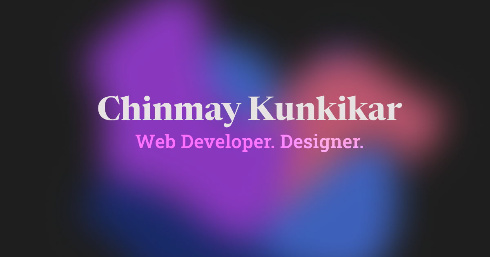

## [chinmaykunkikar.me](https://www.chinmaykunkikar.me)

<p align="center">
  
</p>

<p align="center">🛠️ Built with Next.js, TailwindCSS, and a <i>pinch</i> of Framer Motion 💻</p>

### Local setup

1. Clone this repository.
2. Install dependencies using `npm` or [`bun`](https://bun.sh/):

```bash
bun install
```

3. Start the development server:

```bash
bun run dev
```

Then open **[localhost:3000](http://localhost:3000)** on your favorite browser.

<h4 align="center">Explore, get inspired, and feel free to reach out! ✨</h4>

<p align="center">
  <a href="https://www.linkedin.com/in/chinmaykunkikar/">
    
  </a>
  <a href="mailto:chinmay.kunkikar@gmail.com">
    
  </a>
</p>

</div>
